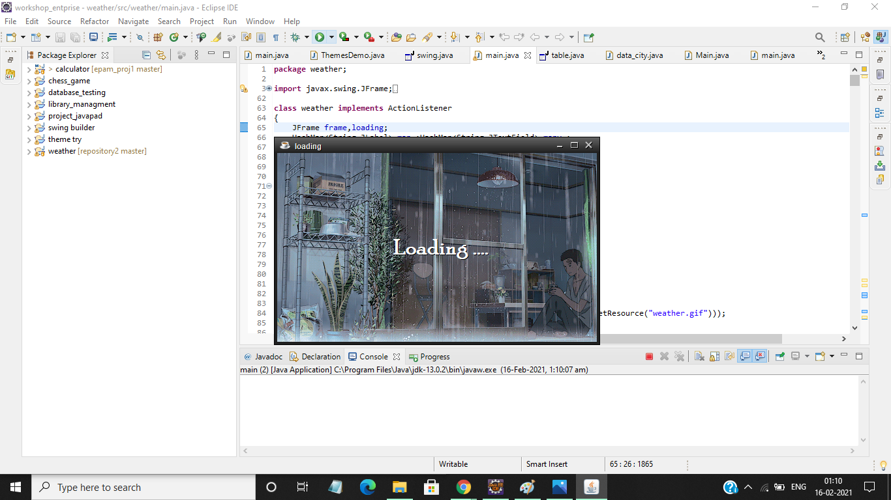
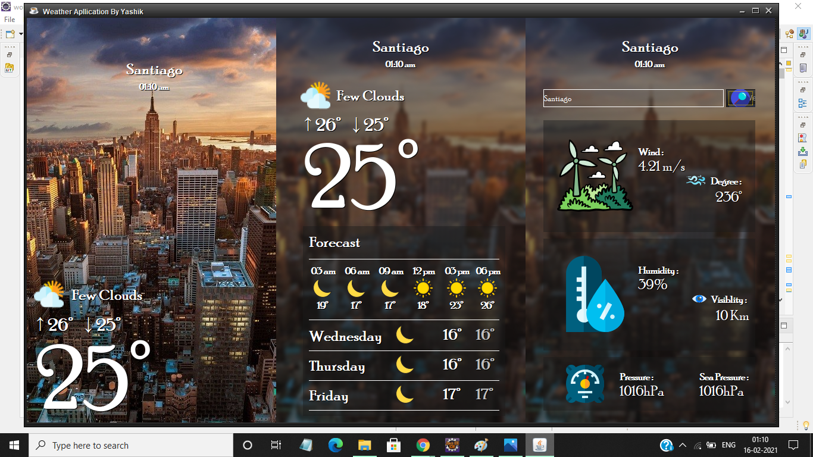
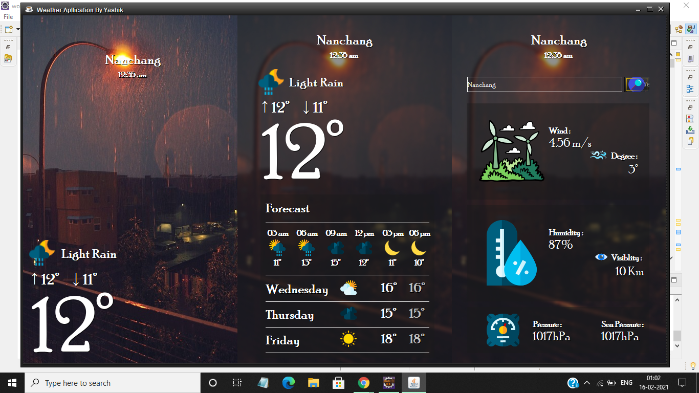
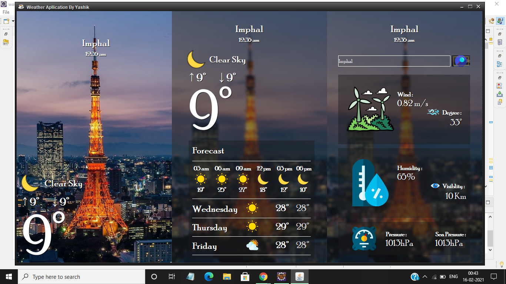
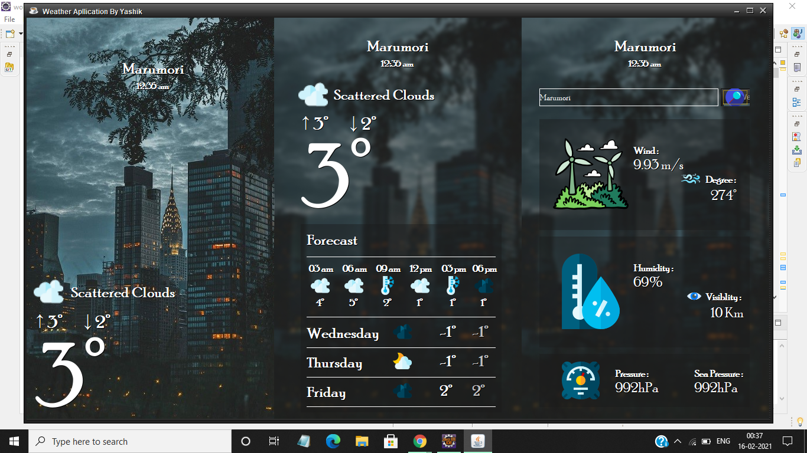
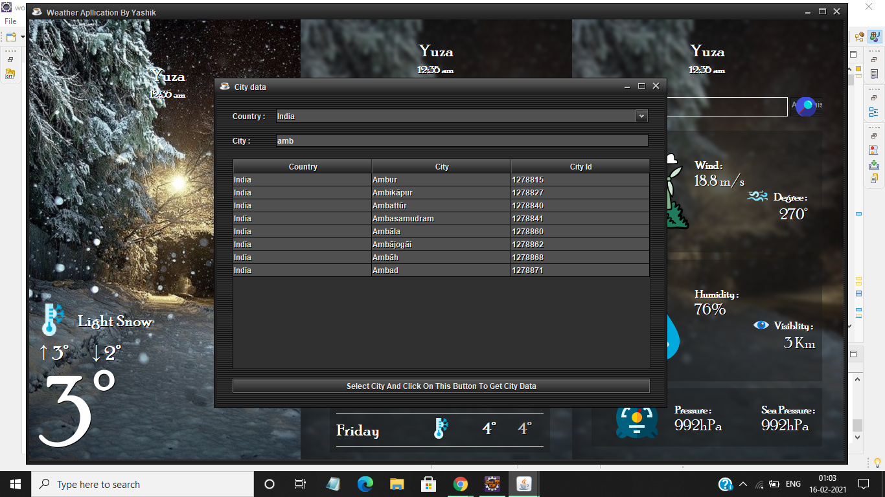
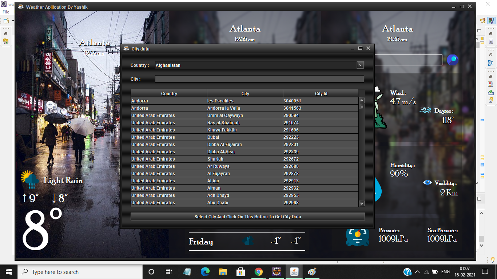

# 🌦 Weather Application Using Java
<b>😉 Heyyy !! Nice To See you!! </b>I made this beautifull UI weather application using Java Swing

____

# 🛠⚙ Try On Your Own Pc ?

Download This - Click [Here](https://github.com/YashikGarg/Weather/tree/master/Java%20Exectuable%20File) To Download
And Run This File

## 💻 Requirment :-

- [x] JDK must be installed in your pc ☕ 

____

# 📽 Video
⏩ - 3x
  

___

# 📸 Screenshots

## Loading Window

## Main Window

&nbsp;&nbsp;
&nbsp;&nbsp;

## Search Window

&nbsp;&nbsp;

____

# 😇 External Libraries

- [x] 🔖 <i>I used <a href="http://www.jtattoo.net/">JTattoo-1.6.13</a> for beautifull themes !!!</i>
- [x] ☕ <i>I used <a href="https://github.com/fangyidong/json-simple">json-simple-1.1</a> for reading JSON Files !!!</i>
- [x] ⛈ <i>API i used <a href="http://openweathermap.org/api">Open Weather</a> for fetching data !!!</i>

___
> <b>If You ♥ It Please Drop a ⭐ 😉</b>
